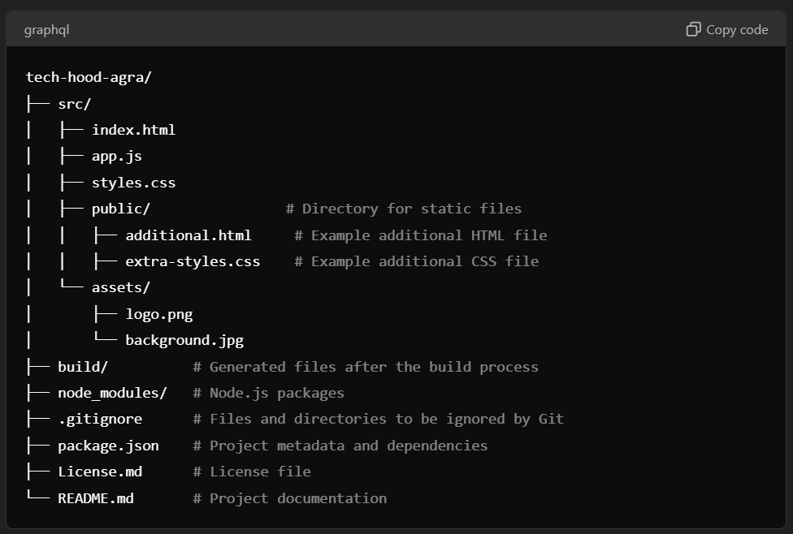

# Tech Hood Agra Website Codebase 🚀

## Project Overview 🌟

The Tech Hood Agra website is a community-driven platform designed to [brief description of the purpose of the platform]. This repository contains the codebase for the website, featuring elements such as [list some key features, e.g., event listings, user profiles, etc.].

<br>

## Project Structure 🗂️



<br>

## Installation ⚙️

To set up the project locally, follow these steps:

1. **Clone the Repository**

    ```bash
    git clone https://github.com/iarmaansingh/tech-hood-agra.git
    ```

2. **Navigate to the Project Directory**

    ```bash
    cd tech-hood-agra
    ```

3. **No need to Install Dependencies**

<br>

## Contributing 🤝

We welcome contributions to the Tech Hood Agra project. To contribute:

1. **Fork the Repository**

2. **Create a New Branch**

    ```bash
    git checkout -b feature-branch
    ```

3. **Make Your Changes**

4. **Commit Your Changes**

    ```bash
    git add .
    git commit -m "Add a descriptive commit message"
    ```

5. **Push to Your Fork**

    ```bash
    git push origin feature-branch
    ```

6. **Create a Pull Request**

    Go to the original repository on GitHub and open a pull request from your branch.

<br>

## License 📜

This repository is licensed under the Tech Hood Agra Proprietary License. For the full terms and conditions, please refer to the `LICENSE.md` file.

<br>

## Acknowledgements 🙏

- **Libraries and Tools**: Tailwind CSS
- **Contributors**: [List any contributors or special mentions]

<br>

<br>

## Contact 📧

For any questions regarding this repository or its content, please contact Tech Hood Agra at [agratechhood@gmail.com].

<br>
